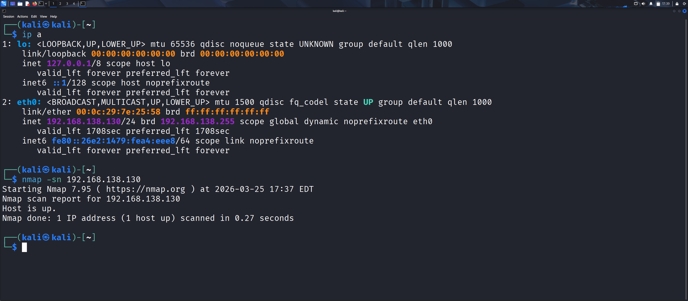

# nmap-network-scan2
Basic network scanning using Nmap to identify active devices and open ports.
Evidence

Observations
-Detected one active host on the network
-The IP address identified was 192.198.138.130
-The host is up and reachable
-The scan was successfully in 0.27 seconds
